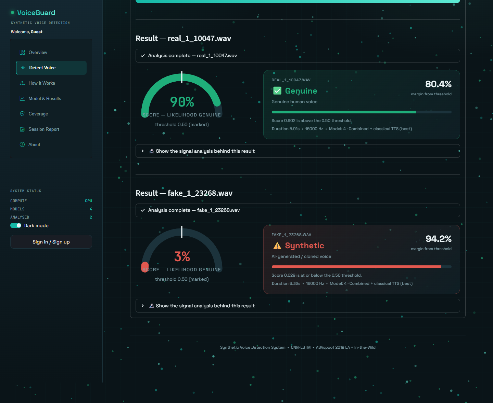
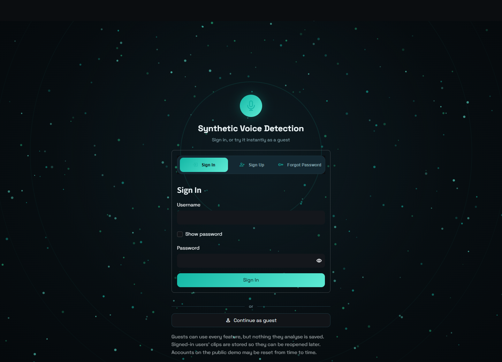
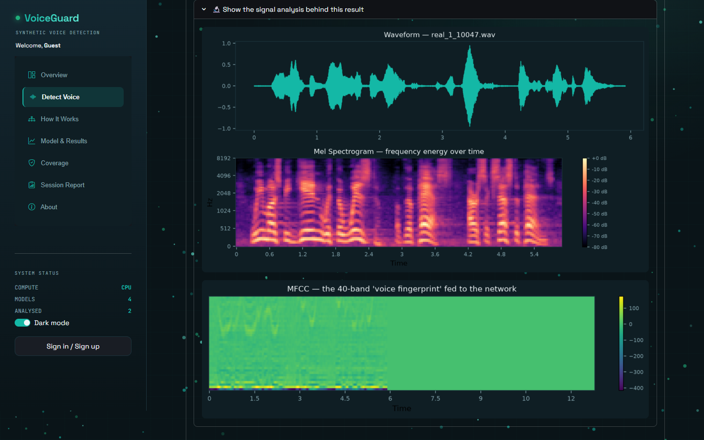
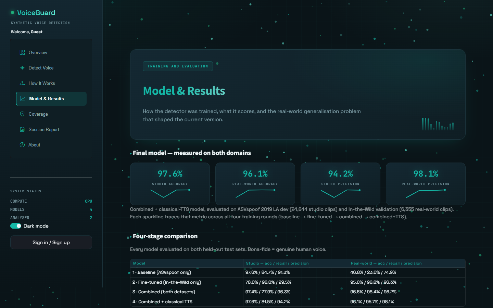
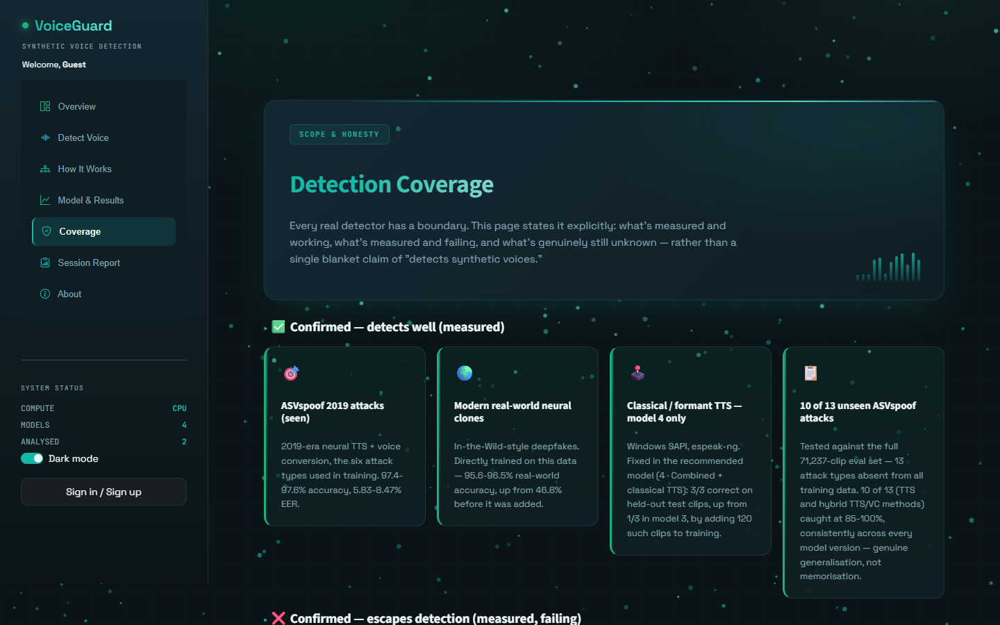
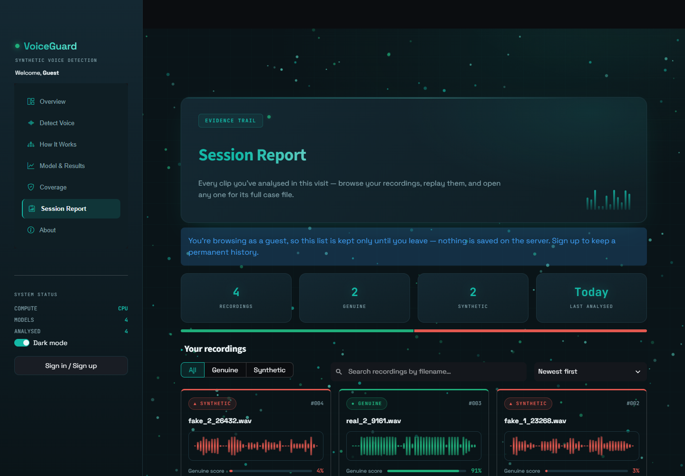
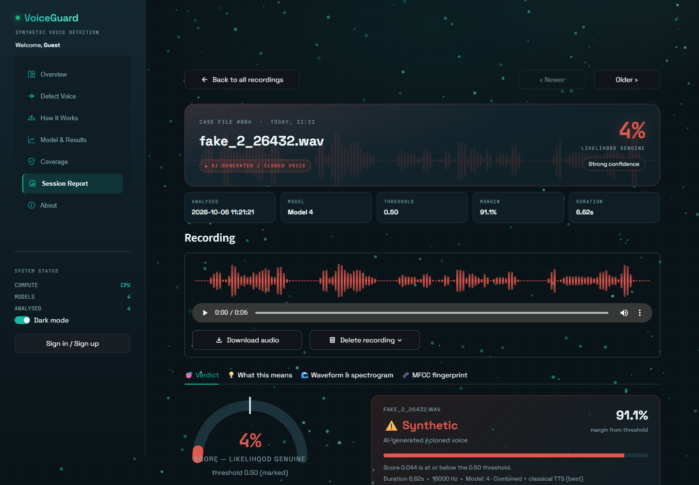
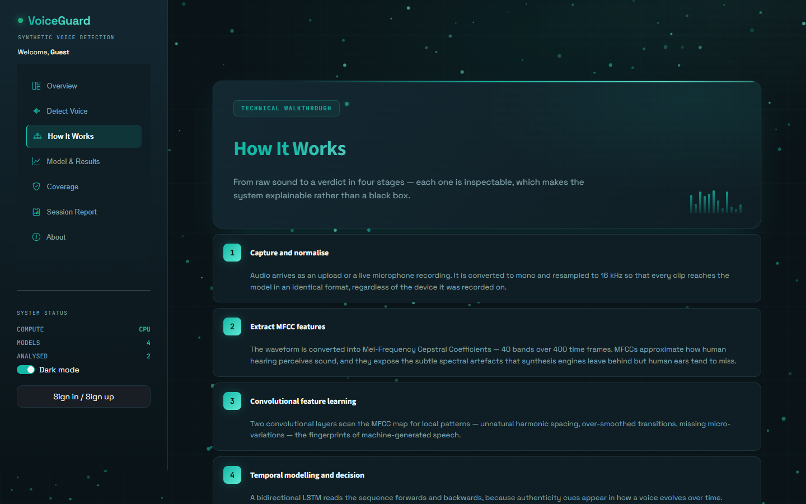

# 🎙️ VoiceGuard — Synthetic Voice Detection

**Upload or record a voice clip, and a deep-learning model tells you whether it's a real human or an AI-generated / cloned voice.**

Voice-cloning tools can now copy someone's voice from a few seconds of audio, and the clones routinely fool human listeners. That powers a growing wave of scam calls: "family emergency" calls, fake executives authorising payments. VoiceGuard is an end-to-end detector built to counter that, from audio preprocessing and model training through to a full web app.

### **[▶ Try the live demo](https://synthetic-voice-detection.streamlit.app)**

No sign-up needed. Click **Continue as guest**. If the app has been idle, give it about 30 seconds to wake up.



---

## Features

- **Upload or record live.** Analyse WAV / MP3 / FLAC files, or record straight from the browser microphone. You can review the recording, then discard or analyse it.
- **Four model versions side by side.** Run the same clip through every training stage to see how the detector improved.
- **An honest score.** A gauge shows the raw likelihood-genuine score, and an adjustable decision threshold lets you move between strict, balanced and lenient. EER reference points are shown for each model.
- **Signal analysis.** See the waveform, mel-spectrogram and the 40-band MFCC "voice fingerprint" the network actually sees.
- **Accounts and history.** Sign up and sign in with bcrypt-hashed passwords, a password-strength check and security-question reset. Every analysis is saved to your account in a recordings library, where each clip is a card with its real waveform. You can filter, search and sort them, then open any one as a full "case file" with playback, verdict, signal plots, a plain-English explanation, download and delete.
- **Guest mode.** Try everything instantly. Guest analyses are kept only for the visit and never stored.
- **Coverage page.** A transparent breakdown of which attack types the model is confirmed to catch, which still escape it, and what's untested.

| Login | Signal analysis |
|---|---|
|  |  |
| **Model & Results** | **Coverage** |
|  |  |
| **Recordings library** | **Case file** |
|  |  |

## How it works

```
Audio clip ─► resample to 16 kHz mono, peak-normalise
           ─► MFCC features (40 coefficients × 400 frames)
           ─► CNN (2 conv blocks) learns local spectral patterns
           ─► Bidirectional LSTM reads them forwards + backwards in time
           ─► mean-pooled → fully connected → sigmoid
           ─► score: likelihood the voice is genuine
```

The model is small (≈0.8 MB) and runs on CPU in about a second per clip. It was trained with PyTorch on a Google Colab T4 GPU.



## Results

The project went through four training stages. Each one fixed a problem found by testing the previous one. All four were evaluated on two held-out test sets: **ASVspoof 2019 LA dev** (24,844 studio-quality clips) and **In-the-Wild** validation (6,355 real-world clips).

Accuracy / bona-fide recall / bona-fide precision:

| Model | Studio (ASVspoof) | Real-world (In-the-Wild) | EER studio / real-world |
|---|---|---|---|
| 1 · Baseline (ASVspoof only) | 97.6% / 84.7% / 91.3% | 46.8% / 23.0% / 74.9% | 5.83% / 41.52% |
| 2 · Fine-tuned (In-the-Wild only) | 76.0% / 96.0% / 29.5% | 95.6% / 96.8% / 96.3% | 7.57% / 4.45% |
| 3 · Combined (both datasets) | 97.4% / 77.9% / 96.3% | 96.5% / 98.4% / 96.2% | 8.47% / 3.56% |
| **4 · Combined + classical TTS** | **97.6% / 81.5% / 94.2%** | **96.1% / 95.7% / 98.1%** | **8.33% / 3.60%** |

**The story behind the numbers:**
1. **Domain mismatch.** The baseline scored 97.6% on studio audio but only 23% recall on real-world recordings. It labelled most real people as synthetic, including the author's own voice.
2. **Catastrophic forgetting.** Fine-tuning on real-world data alone fixed that, but studio precision collapsed to 29.5%, so it started passing spoofs through as genuine.
3. **Joint training.** Training on both datasets at once solved both problems, cutting real-world EER from 41.5% to 3.6%.
4. **Closing a gap.** Testing showed classical formant-based TTS voices (Windows SAPI, eSpeak) still slipped through. A small targeted set of 120 such clips fixed it, and all 3 held-out samples were then correctly caught.

### Known limitation

On the ASVspoof 2019 evaluation set (71,237 clips, 13 unseen attack types), the final model catches **10 of 13 attacks at 92–100%**. The exceptions are three **pure voice-conversion attacks (A17, A18, A19)**, caught at only 17–70%. These reshape a real speaker's recording rather than generating new audio, so they keep natural prosody and breathing. That leaves few of the artefacts an MFCC + CNN-BiLSTM model looks for. This is a known open problem in anti-spoofing research, and it's the main direction for future work.

## Tech stack

**Python · PyTorch · Librosa · Streamlit · SQLite · bcrypt · Matplotlib**. Trained on Google Colab (NVIDIA T4).

Datasets: [ASVspoof 2019 LA](https://www.asvspoof.org/) and [In-the-Wild](https://deepfake-total.com/in_the_wild) (Müller et al., 2022).

## Run it locally

```bash
git clone https://github.com/josephamal10/synthetic-voice-detection.git
cd synthetic-voice-detection
python -m venv venv
venv\Scripts\activate          # macOS/Linux: source venv/bin/activate
pip install -r requirements.txt
streamlit run app.py
```

Requires Python 3.11+ and [ffmpeg](https://ffmpeg.org/) on your PATH (used to decode browser mic recordings and MP3s).

## Project structure

```
app.py                     Streamlit app: UI, audio pipeline, model inference
auth.py                    Accounts + per-user analysis history (SQLite, bcrypt)
best_model*.pt             The four trained model checkpoints
demo_clips/                Real and fake sample clips for trying the app
sample_clips/              Classical-TTS held-out test samples
classical_tts_augmentation/  The 120-clip classical TTS training set
figures/                   ROC, DET and confusion-matrix plots
```

## Author

**Joseph Amal A** · [GitHub](https://github.com/josephamal10)
